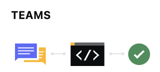

# Federating a Domain and Subdomain to a Third-Party Identity Provider in Microsoft Entra

> [!NOTE]
> TL;DR - The "IssuerUri" property need to be unique for every federation configuration in the tenant. It also seems as if you cannot re-use a previously configured value.

This article descibes my observations when trying to configure domain and subdomain federation in Entra ID

### :lock: Suggestion for Entra ID Roles
`Domain Name Administrator`

### :lock: Suggestion for Graph Permissions
`Domain.ReadWrite.All`


## Add your domain to the Entra ID tenant

```
$params = @{
    id = "yourdomain.com"
}
New-MgDomain -BodyParameter $params
```
**Get the TXT-verification**
```
(Get-MgDomainVerificationDnsRecord -DomainId $domain | Where-Object { $_.recordtype -eq "Txt" }).AdditionalProperties.text
```
**Configure your DNS and verify the domain**
```
Confirm-MgDomain -DomainId "yourdomain.com"
```


